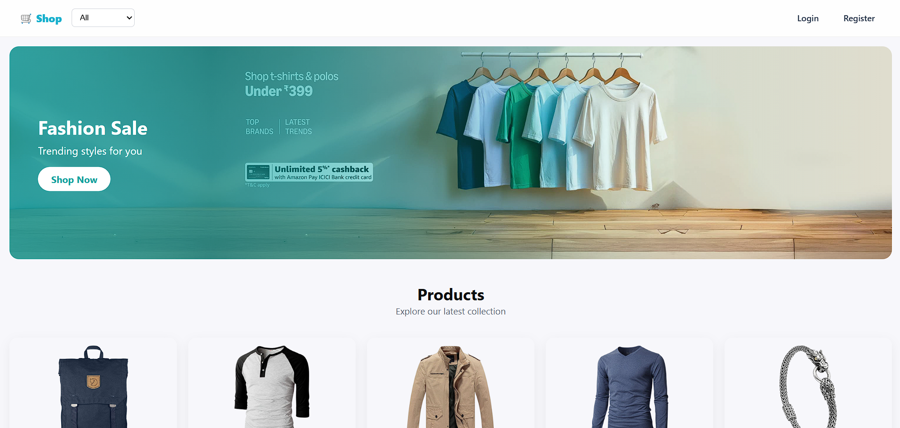

<h1 align="center">🛒 React E-Commerce Capstone Application</h1>

<p align="center"> 
   
   
   
  
  
  
   
</p> 

<p align="center">
  A production-style <b>React E-Commerce Web Application</b> built as a 
  <b>Capstone Internship Project</b>.  
  The app simulates a complete online shopping experience including 
  <b>product catalog, authentication, cart persistence, checkout flow</b>, 
  and <b>CI/CD deployment</b>.  
  Designed following real-world frontend development practices.
</p>

---

## 🚀 Live Demo  
🔗 **View Project:**  [🛒 React E-Commerce Capstone](https://ecommerce-capstone-shop.vercel.app/)

📸 **Preview:**  
<p align="center">
  
</p>

---

## 🎯 Features

- 🛍️ Product listing using FakeStoreAPI  
- 🔍 Product details page  
- 🧭 Client-side routing with React Router  
- 🔐 User authentication (simulated)  
- 🛒 Add / remove items from cart  
- 🔢 Quantity management  
- 💾 Persistent cart & auth using LocalStorage  
- 🔒 Protected routes (Cart & Checkout)  
- 🧾 Checkout form with validation  
- ✅ Order summary & confirmation screen  
- ⚡ Lazy loading & skeleton loaders  
- 📱 Fully responsive (mobile & desktop)

---

## 🛠️ Technologies Used

- **React JS**  
  *(Component-based architecture, hooks)*  
- **React Router DOM**  
  *(Modern routing & protected routes)*  
- **Context API**  
  *(Global state management)*  
- **FakeStoreAPI**  
  *(External e-commerce API)*  
- **LocalStorage API**  
  *(Persistent state)*  
- **Vercel**  
  *(Deployment with CI/CD)*  

---

## 🧠 How the App Works

1. Products are fetched from FakeStoreAPI
2. Users browse products & view details
3. Authentication state is managed via Context API
4. Cart state persists using LocalStorage
5. Protected routes restrict checkout access
6. Checkout form validates user input
7. Order confirmation displayed on success
8. App auto-deploys via GitHub → Vercel

---

## 🔐 Authentication & Authorization

- Simulated Login & Register flow  
- Auth state stored in LocalStorage  
- Global auth management using Context API  
- Protected routes restrict unauthenticated access  

---

## 🛒 Cart & Checkout Flow

- Add products to cart
- Update quantities or remove items
- Cart persists after refresh
- Checkout form validates user input
- Order summary displayed
- Confirmation shown after successful order

---

## ⚡ Performance & Optimization

- Lazy loading of pages
- Skeleton loaders during API calls
- Conditional rendering
- Optimized component structure
- Clean separation of concerns

---

## 📂 Project Structure

```bash
ecommerce-capstone-shop/
│── public/
│── src/
│   ├── components/ # Reusable UI components
│   ├── pages/ # Page-level components
│   ├── contexts/ # Auth, Cart, Order contexts
│   ├── hooks/ # Custom hooks
│   ├── services/ # API services
│   ├── styles/ # Global styles
│   ├── App.js
│   ├── index.js
│   └── vercel.json # React Router rewrite config
└── README.md
```

---

## 📅 7-Day Development Plan

| Day | Task |
|----|------|
| Day 1 | Project setup & architecture planning |
| Day 2 | Product catalog & filtering |
| Day 3 | Product details & cart functionality |
| Day 4 | Authentication & protected routes |
| Day 5 | Checkout process & validation |
| Day 6 | Performance optimization & UI polish |
| Day 7 | Deployment, testing & documentation |

---

## 🚀 How to Run Locally

1. Clone the repository:
```bash
git clone https://github.com/saicharanjanagama/ecommerce-capstone-shop.git
cd ecommerce-capstone-shop
```
2. Install dependencies:
```bash
npm install
```
3. Start the development server:
```bash
npm start
```

---

## 📈 What This Project Demonstrates

- Real-world React application architecture
- Routing & protected routes
- State management for scalable apps
- API integration & async handling
- Persistent storage logic
- Production deployment with CI/CD

---

## 👨‍💻 Author

It’s me — **Sai Charan Janagama** 😄<br>
🎓 Computer Science Graduate | 🌐 Aspiring Full Stack Developer<br>
📧 [Email Me](saic89738@gmail.com) ↗<br>
🔗 [LinkedIn](https://www.linkedin.com/in/saicharanjanagama/) ↗<br>
💻 [GitHub](https://github.com/SaiCharanJanagama) ↗

---

## 💬 Feedback

If you have any feedback or suggestions, feel free to reach out!  
Your input helps me improve 🚀
>>>>>>> 8a0ffeca3b3cf2ee9c5d1b9bd462f430ba6a8f4f
